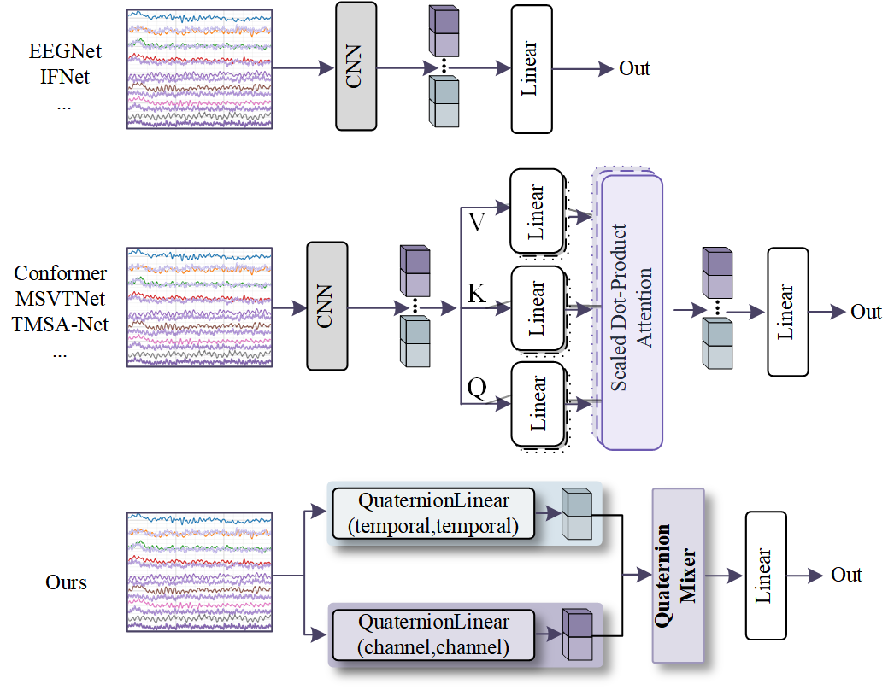
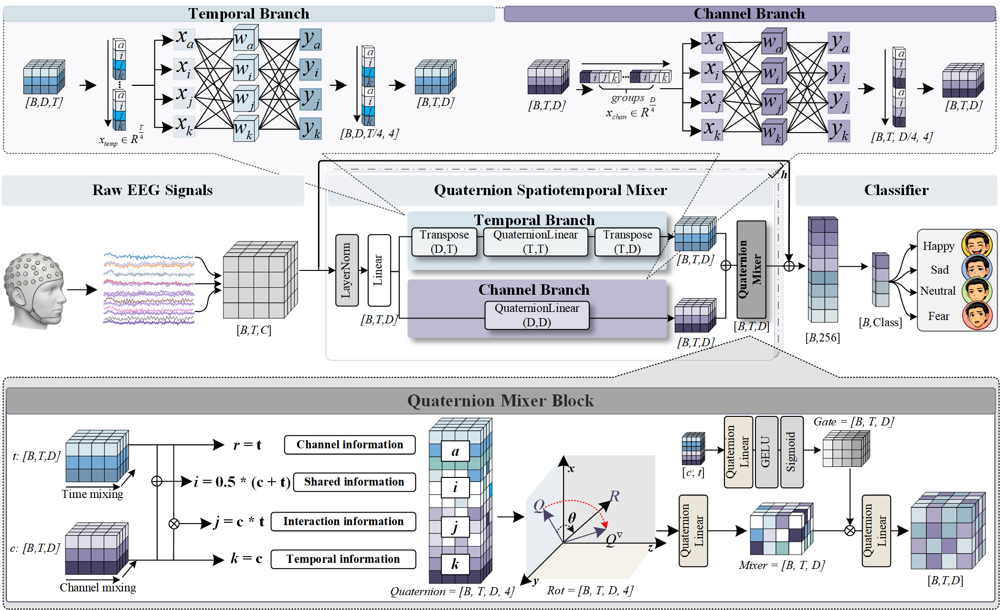

# Q-Mixer: A Quaternion Spatiotemporal Mixer for Cross-Subject EEG Decoding

---

## 📌 Overview

Cross-subject EEG decoding remains fundamentally challenging due to **significant spatiotemporal distribution shifts across subjects**. Existing deep learning methods typically rely on **implicit feature learning**, which:

- lacks structural interpretability
- requires large parameter budgets
- struggles to explicitly model spatiotemporal coupling

To address these limitations, we propose **Q-Mixer**, a **Quaternion Spatiotemporal Mixing Network**, which introduces **explicit structured coupling** into EEG modeling.

---

## 🧠 Key Idea

Instead of treating temporal and spatial dependencies implicitly, Q-Mixer:

> **explicitly decomposes and re-organizes EEG representations into structured components within a quaternion space**

Specifically, Q-Mixer models EEG signals as:

- Spatial information  
- Temporal information  
- Shared/global information  
- Interaction information  

These components are then **jointly coupled and rotated in a hypercomplex space**.

---

## 🧩 Model Architecture

### 🔹 Overall Framework (Fig.1)

<p align="center">

</p>

Q-Mixer consists of:

- **Temporal branch**: models temporal dynamics
- **Spatial branch**: captures inter-channel topology
- **Quaternion Mixer**: structured fusion in hypercomplex space
- **Gating mechanism**: adaptive feature selection

---

### 🔹 Quaternion Mixer (Fig.2)

<p align="center">

</p>

Instead of naive fusion (sum / concat), Q-Mixer constructs:

\[
q = (q_{temporal}, q_{shared}, q_{interaction}, q_{spatial})
\]

The implementation uses this same tuple order. The interaction component is
the Hamilton product of the normalized channel and temporal representations.

This enables:

- explicit disentanglement
- structured coupling
- higher-order interaction modeling

---

## 🚀 Why Quaternion?

Unlike real-valued networks:

- Quaternion algebra naturally supports **multi-component coupling**
- Enables **compact parameterization**
- Provides **structured inductive bias**

> Q-Mixer is not a simple replacement of real-valued layers,  
> but a **reformulation of EEG representation learning**.

---

## 📊 Experimental Results

### Datasets

We evaluate on **6 public EEG datasets**:

- Emotion: **SEED, SEED-IV, SEED-V**
- Motor Imagery: **BNCI2014001, Blankertz2007, BNCI2014002**

All experiments follow **LOSOCV (Leave-One-Subject-Out)**.

---

### 🔥 Main Results

- **Emotion recognition**:
  - Q-Mixer achieves **best performance on all datasets**
  - Consistent improvements in **Acc / F1 / AUC**

- **Motor imagery**:
  - Best on BNCI2014001 & Blankertz2007
  - Second-best on BNCI2014002

---

### 🧪 Key Observations

- Robust across **different tasks**
- Stable under **cross-subject distribution shifts**
- Generalizes beyond a single EEG paradigm

---

## ⚙️ Efficiency

Parameter counts are reported from the instantiated networks, including all
trainable biases and normalization parameters. Reproduce the per-layer report
for all four entry points with:

```bash
python tools/count_parameters.py
```

The D=512 Q-Mixer configurations are not labeled as a 22.6K-parameter JSED
model; that number requires a separately versioned JSED implementation.

---

## 🔬 Ablation Insights

We systematically validate the effectiveness of the proposed design:

### 1️⃣ Fusion Strategy

- Sum / Concat → weak
- Linear → better
- Interaction → improved but unstable
- **Q-Mixer → consistently best**

👉 Indicates:
> performance gain comes from **structured quaternion fusion**, not architecture size

---

### 2️⃣ Component Analysis

Removing any component degrades performance:

- w/o Interaction → largest drop
- w/o Shared → unstable alignment
- w/o Spatial / Temporal → incomplete representation

👉 Confirms:
> all four components are **functionally necessary**

---

### 3️⃣ Gating Mechanism

- Improves only when fusion quality is high
- Limited or negative effect on naive fusion

👉 Indicates:
> gating works **only with structured representation**

---

## 📌 Key Contributions

- ✅ Propose a **quaternion spatiotemporal mixer** for EEG decoding  
- ✅ Introduce **explicit structured coupling** instead of implicit learning  
- ✅ Achieve **robust cross-subject generalization** across 6 datasets  
- ✅ Publish exact model configurations and reproducible parameter accounting

---

## 📖 Conclusion

Q-Mixer demonstrates that:

> **Explicit structured modeling in hypercomplex space is a viable and efficient paradigm for EEG decoding**

This provides a new direction for:

- EEG representation learning
- Low-parameter neural modeling
- Cross-subject generalization

---

## 📂 Code

```bash
git clone https://github.com/liuyici/Q-Mixer.git
